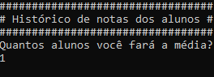
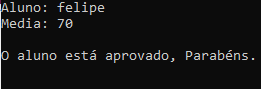

## 💻 Projeto
Calcula a media dos alunos e passa se ele estará aprovado ou reprovado.

## :rocket: Tecnologias:

Esse projeto foi desenvolvido com as seguintes tecnologias:

- [C#][Csharp]

-------
Feito por Amadeu Filipe Lopes 👋🏽 [Entre em contato!](https://www.linkedin.com/in/amadeu-filipe-lopes12/)

[C#]: https://docs.microsoft.com/pt-br/dotnet/csharp/tour-of-csharp/

